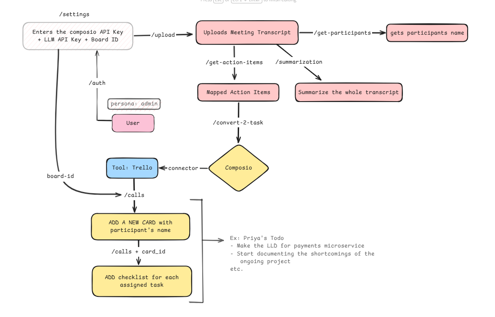

# AuraAI — Meeting Intelligence Platform

A SaaS-style web application that automates meeting minutes and transforms conversations into actionable tasks. Upload a meeting transcript and AuraAI generates a structured summary, extracts participants and their action items, and syncs those tasks straight to Trello — plus a RAG-powered chatbot to ask questions about your documents.



**🎥 Video Demo:** https://youtu.be/3sg3yXFlx8k?si=K0yFD0Tce0HjWUiI

---

## 🚀 Features

- **Auto-Generated Minutes** — AI-powered summarization of uploaded meeting transcripts (`.docx`)
- **Smart Task Management** — Automatically extracts per-participant action items and converts them into tasks
- **Trello Automation** — One click syncs action items into Trello (creates each participant's Todo list, card, and checklist)
- **Document Q&A Chatbot** — RAG-based assistant that answers questions grounded in your uploaded transcripts and documents
- **Admin Chatbot** — Natural-language board control ("assign 'Send invoice' to Vatsal by Friday", "what's overdue?")
- **Role-Based Access** — Separate **admin** and **employee** personas with workspace-scoped data
- **Task Tracking** — Organize and track tasks with filters and due dates
- **Clean Interface** — Modern black & white aesthetic inspired by OpenAI

---

## 🛠️ Tech Stack

| Layer | Technology |
|-------|-----------|
| **Frontend** | React 18, Vite, React Router, Framer Motion, Tailwind CSS |
| **Backend** | FastAPI, Uvicorn, Motor (async MongoDB driver) |
| **Database** | MongoDB |
| **AI / LLM** | LangChain + Groq (`llama-3.3-70b-versatile`) |
| **Integrations** | Composio → Trello, Google OAuth |
| **Auth** | JWT (python-jose) + bcrypt, Google Sign-In |

---

## 📁 Project Structure

```
AuraAI/
├── Backend/              # FastAPI application
│   ├── main.py           # App entry point, router registration, CORS
│   ├── llm.py            # Central LLM factory (Groq)
│   ├── auth/             # Signup / login / Google OAuth + JWT
│   ├── meetings_routes.py, meetings_service.py   # Transcript → minutes/tasks
│   ├── trans2action/     # RAG document Q&A chatbot
│   ├── automations/      # Composio → Trello task writer
│   ├── admin/            # Admin NL chatbot (assign / query board)
│   ├── userload/         # Employee task views
│   ├── composio_auth.py, composio_routes.py      # Trello OAuth via Composio
│   └── settings_routes.py                        # Per-user API keys & board id
├── Frontend/             # React + Vite single-page app (source in src/)
├── Model/                # Standalone transcript-processing prompts (tasks.py)
└── requirements.txt
```

---

## ✅ Prerequisites

- **Python** 3.10+
- **Node.js** 18+
- **MongoDB** (local or a MongoDB Atlas connection string)
- A **Groq** API key (per user, added in-app under Settings) — https://console.groq.com/keys
- *(Optional)* A **Composio** API key for Trello automation and a **Google OAuth** client ID for Google Sign-In

---

## 🏁 Getting Started

### 1. Backend

```bash
cd Backend

# create & activate a virtual environment
python -m venv venv
# Windows
venv\Scripts\activate
# macOS / Linux
source venv/bin/activate

# install dependencies
pip install -r ../requirements.txt

# create Backend/.env (see Environment Variables below), then run:
python main.py
```

The API runs at **http://localhost:8000** (docs at `/docs`).

### 2. Frontend

```bash
cd Frontend

npm install

# create Frontend/.env (see below), then run:
npm run dev
```

The app runs at **http://localhost:3000**.

---

## 🔑 Environment Variables

**`Backend/.env`**

```env
MONGODB_URI=your_mongodb_connection_string
SECRET_KEY=your_jwt_secret
GOOGLE_CLIENT_ID=your_google_oauth_client_id
```

**`Frontend/.env`**

```env
VITE_API_URL=http://localhost:8000
VITE_GOOGLE_CLIENT_ID=your_google_oauth_client_id
```

> **Note:** Each user's **Groq** and **Composio** API keys and their **Trello board ID** are configured inside the app under **Settings**, not in `.env`.

---

## ⚙️ How It Works

1. **Sign in** — Register/login (email + password or Google); a JWT secures every request.
2. **Configure** — In Settings, add your Groq key (for AI), Composio key + Trello board ID (for task sync).
3. **Upload a transcript** — An admin uploads a `.docx`; the backend loads and chunks it, then the Groq LLM produces a **summary**, **participant list**, and **per-participant action items**, stored in MongoDB.
4. **Review minutes** — View the generated summary and action items per meeting.
5. **Sync to Trello** — Convert action items into Trello tasks (`{Participant}'s Todo` list → card → "Tasks" checklist).
6. **Ask questions** — Use the RAG chatbot to query your uploaded documents; employees track and tick off their assigned tasks.

---

## 📡 API Overview

| Area | Endpoints |
|------|-----------|
| **Auth** | `POST /auth/signup`, `POST /auth/login`, `POST /auth/google`, `GET /auth/me` |
| **Meetings** | `GET /meetings`, `POST /meetings/upload`, `GET /meetings/{id}`, `POST /meetings/{id}/convert-to-task` |
| **Settings** | `GET /settings`, `PUT /settings` |
| **Documents (RAG)** | `POST /trans2actions/upload`, `POST /trans2actions/query`, `GET /trans2actions/documents`, `DELETE /trans2actions/documents/{id}` |
| **Trello (Composio)** | `POST /composio/trello/initiate`, `GET /composio/trello/status`, `GET /composio/trello/boards`, `GET /composio/trello/cards`, `POST /composio/trello/disconnect` |
| **Admin** | `POST /admin/assign-task` |
| **Employee** | `GET /userload/tasks`, `POST /userload/update-task` |

---

## 📄 License

This project is provided as-is for demonstration purposes.
